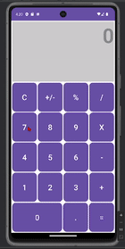

# C323 Project 2 Calculator

This is a calculator app for an Android Device.

## Functionality 

The following **required** functionality is completed:

* [ ] User sees the UI of a standard calculator with 0-9, +,-, /, *, ., C, %, =
* [ ] User can use the standard calculator functions
* [ ] Calculator works properly with the logical operations
* [ ] Calculator can change orientation and use a different layout
* [ ] Calculator saves data between changes and obtains new buttons when horizontal
* [ ] Calculator has a new app Icon. Icon made by me.

The following **extensions** are implemented:

* ...
* ...

## Video Walkthrough

Here's a walkthrough of implemented user stories:

## Notes

Describe any challenges encountered while building the app.
My horizontal layout was not loading correctly with the new layout for many of my attempts when swapping between vertical and horizontal layouts. 
App Icon Made by Me.

## License

    Copyright [2023] [Kevin Schoonover]

    Licensed under the Apache License, Version 2.0 (the "License");
    you may not use this file except in compliance with the License.
    You may obtain a copy of the License at

        http://www.apache.org/licenses/LICENSE-2.0

    Unless required by applicable law or agreed to in writing, software
    distributed under the License is distributed on an "AS IS" BASIS,
    WITHOUT WARRANTIES OR CONDITIONS OF ANY KIND, either express or implied.
    See the License for the specific language governing permissions and
    limitations under the License.
